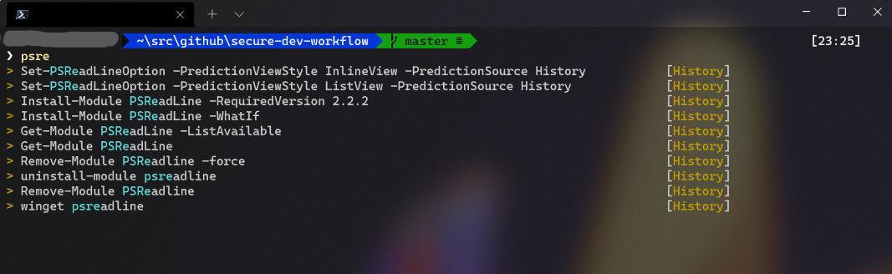

# Improve shell experience & security

How I set up my development environment to improve my workflow and enhance security posture as part of a defense in depth strategy.

The core objectives are to protect the ssh private key file (often used without a password) and protect source code at rest. Should laptop(s) go awry or an attacker gain access to the file system and get the ssh-key files then you have the best possibility of avoiding further losses.

This whole process takes approximately 30 minutes.

## Your shiny new PowerShell awaits

If you enable all the features, your shiny new shell should now look something like this. Here I'm searching the history by typing the term `psre`. Note my machine name is masked under the gray and this will be your `user@hostname`.



## Environment

- Windows 10 / 11
- PowerShell (6 / 7++ / core)
- Git, Posh-Git and SSH
- Optionally Oh-My-Posh and PSReadLine
- This walk-through expects git and ssh to have been installed already: see [Installing Git](https://git-scm.com/book/en/v2/Getting-Started-Installing-Git)

## What can I get from this?

- Improved security posture within your development work-flow
- Improved ease of use for git and ssh when using password protected ssh-key files
- New tooling that works with the work-flow to enhance productivity

### Security Enhancements

- Git and ssh work-flows that make use of ssh private key file password security (be sure to set a strong unique password)
- Utilize Windows 10 / 11 ssh-agent components for native integration with PowerShell when using git with ssh (and ssh natively)
- Improve security on shared systems (e.g. virtual desktops) by working with source code in your profile (when used with disk encryption)

### Style and Usability Enhancements

- Windows Terminal enhancements with oh-my-posh
- Uses integrated Windows OpenSSH Agent so you _can work natively in PowerShell_
- Enhanced PowerShell font readability with Unicode support for a graphical prompt to show git context information
- Source code directory consistency and new functions to support this flow: e.g. ```cdc <tab-complete to change to the source directory>```
- PSReadLine command line history with predictive intellisense will revolutionize how you use history and work with the shell

## Getting Started

1. Configure Microsoft Terminal for enhanced readability using unicode fonts and usage with Git workflows

    Read [Enhance Windows Terminal](/terminal/readme.md)

1. Add Windows OpenSSH capability to better integrate with PowerShell

   Read [Integrating OpenSSH with PowerShell](/pwsh/readme.md)

1. Create the following directory to contain your source code securely in your profile. Be sure to enable disk encryption (or at least file system directory encryption for this directory) and if roaming profiles are used within your organization understand whether your user profile is right for your security posture.

   ```text
    ~\src - path to source code in your user profile
   ```

### Creating SSH Keys with Passwords

GitHub has an article that walks you through: [setting up ssh keys](https://docs.github.com/en/authentication/connecting-to-github-with-ssh/generating-a-new-ssh-key-and-adding-it-to-the-ssh-agent)

- Be sure to set a password (passphrase) for your ssh keys!
- You can add new ssh keys here: GitHub -> Profile -> Settings > [ssh keys](https://github.com/settings/keys)
- Remember to clone with ssh as part of this new workflow.
  
You are now ready to use git with password protected ssh private keys.

*Secure, Sync, Code, Enjoy!*

[](https://www.buymeacoffee.com/ukbendavies)

Buy me coffee :)
